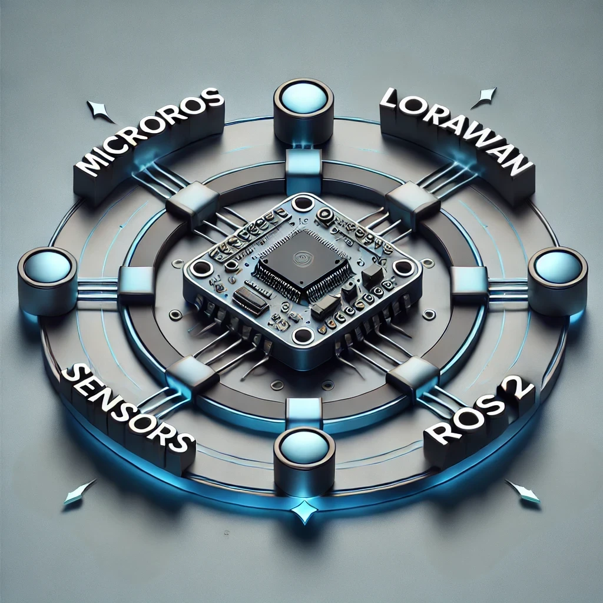

# Micro-ROS for LoRa-E5

## WiseVision MicroRos for LoRa-E5 – What It Is and How It Works

## Introduction
**WiseVision MicroRos for LoRa-E5** is firmware designed for the [**Wio-E5 Dev Board**](https://wiki.seeedstudio.com/LoRa_E5_Dev_Board/), enabling communication over **LoRaWAN** and **serial** protocols. This solution integrates seamlessly with ROS 2 systems, allowing flexible and efficient management of sensors, ROS messages, and custom actions.

The firmware acts as a bridge, supporting advanced IoT functionalities and ensuring that data flows smoothly between LoRaWAN gateways, ROS 2 networks, and connected sensors.

---

## What Does It Do?

**WiseVision MicroRos for LoRa-E5** provides the following core functionalities:

### 1. LoRaWAN Communication
The firmware enables the Wio-E5 Dev Board to:
- **Send and Receive ROS Messages**: The board can send ROS messages over LoRaWAN, enabling low-power long-range communication with gateways.
- **Manage Sensors Dynamically**:
  - **Add Sensors**: Connect new sensors by uploading their configurations to the board.
  - **Remove or Modify Sensors**: Update sensor configurations or remove them as needed.
  - **Receive Sensor Data**: Collect and transmit data from connected sensors to a LoRaWAN gateway.
- **ROS Subscriber for Topics**:
  - The user can create a ROS subscriber on the board. When the board is connected to a system with a **Micro-ROS Agent**, it will detect matching topics and forward their messages over LoRaWAN to a gateway.
  - Subscribers can also be removed dynamically.
- **Custom Topic Actions**:
  - Users can define custom actions triggered by specific ROS topics. These actions allow the board to execute predefined instructions when a message is received on the subscribed topic.

### 2. Serial Communication with Micro-ROS Agent
The firmware also supports direct communication over **serial**:
- **Dynamic Topic Subscriptions**:
  - Add or remove topic subscriptions directly via a **ROS service** communicating with the **Micro-ROS Agent**..
  - Subscriptions can include custom actions that define how messages on a topic are handled.
- **Publisher for Sensor Data**:
  - When connected via serial to a system with the **Micro-ROS Agent**, the board automatically creates a publisher in the ROS 2 system.
  - This publisher streams data collected from the attached sensors, making it accessible in the ROS 2 environment.

---

## How Does WiseVision MicroRos for LoRa-E5 Work?

### LoRaWAN Communication Flow
- Sensors connected to the board transmit data to the Wio-E5.
- The board processes this data and sends it to a LoRaWAN gateway as ROS messages.
- Users can configure, modify, or remove sensors remotely through LoRaWAN communication.
- ROS subscribers created on the board allow the board to listen to topics in a ROS system and forward their messages over LoRaWAN.
- Custom actions for topics enable the board to perform specific instructions when receiving messages.

### Serial Communication Flow
- When connected via serial to a system with the Micro-ROS Agent, the board integrates into the ROS 2 network.
- It creates publishers that stream data from connected sensors into the ROS 2 system.
- Users can dynamically manage topic subscriptions and assign custom actions via the serial connection.

---

## Key Features

1. **LoRaWAN Integration**:
   - **Long-Range Communication**: Send ROS messages over long distances with low power consumption.
   - **Dynamic Sensor Management**: Add, remove, or modify sensors remotely.
   - **Custom Actions**: Assign custom actions to ROS topics to handle messages with predefined behaviors.
   - **Topic Bridging**: Forward messages from ROS topics to LoRaWAN gateways.

2. **Micro-ROS Serial Communication**:
   - **Dynamic Topic Management**: Add or remove subscriptions and custom actions via serial.
   - **Data Publishing**: Automatically create publishers for sensor data when connected to a system with the Micro-ROS Agent.

3. **Dual Communication Modes**:
   - Operates over both **LoRaWAN** and **serial**, providing flexibility in how data and messages are transmitted.

#
_Written by: Cezary Krzeminski, wisevision_ 

Do you need support with this topic or have questions about your project? Feel free to contact us! [support@wisevision.tech](mailto:support@wisevision.tech)

