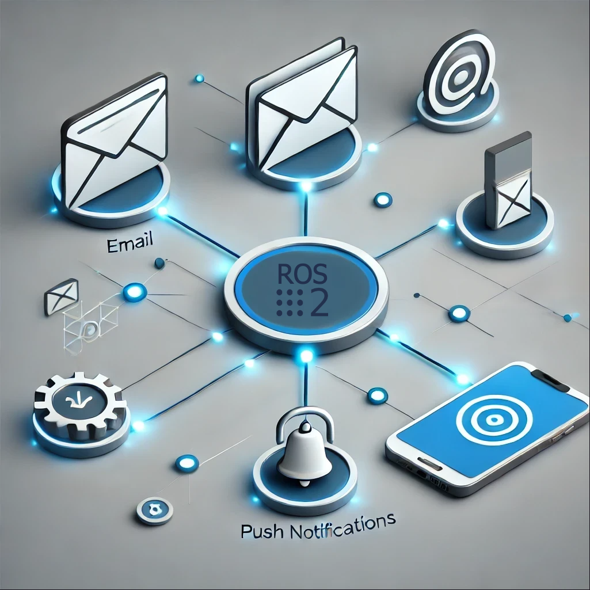

# About

## What It Is and How It Works

## Introduction
**WiseVision Notificator** is a system designed to handle notifications in ROS 2 environments. By subscribing to a specific topic (`/notifications`), it processes notification messages and ensures they are delivered to users. This delivery can occur via two main methods:
- **Email**: Notifications are sent to a user’s email address.
- **Push Notifications**: Notifications are delivered to a mobile application using Firebase.

Additionally, users can configure the destination email or mobile device for receiving notifications, ensuring a personalized and flexible notification experience.

---

## What Does It Do?

**WiseVision Notificator** enables the following functionalities:

1. **Subscription to Notifications Topic**:
   - The system subscribes to the ROS 2 topic `/notifications`, which publishes various notification messages.
   - It listens for messages in real-time and processes them for delivery.

2. **Delivery Methods**:
   - **Email Notifications**:
     - Notification messages are sent to a user’s configured email address.
   - **Push Notifications**:
     - Messages are delivered as push notifications to a mobile application via Firebase Cloud Messaging (FCM).

3. **User Configuration**:
   - Users can specify where notifications are sent:
     - **Email Address**: Define the email address where notifications should be delivered.
     - **Device Registration**: Register a device (using Firebase) to receive push notifications.

---

## Key Features

1. **Real-Time Notifications**:
   - Listens to the `/notifications` topic and delivers messages as they are published.

2. **Flexible Delivery Methods**:
   - Supports multiple delivery methods:
     - Email for reliable, text-based notifications.
     - Push notifications for instant, app-based alerts.

3. **Customizable User Settings**:
   - Users can configure:
     - **Email Address**: Define or update the recipient's email.
     - **Device Registration**: Specify which device should receive push notifications using Firebase.

4. **Seamless ROS 2 Integration**:
   - Works natively with ROS 2 topics and integrates smoothly into existing systems.

---
_Written by: Cezary Krzeminski, wisevision_ 

Do you need support with this topic or have questions about your project? Feel free to contact us! [support@wisevision.tech](mailto:support@wisevision.tech)
