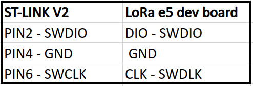
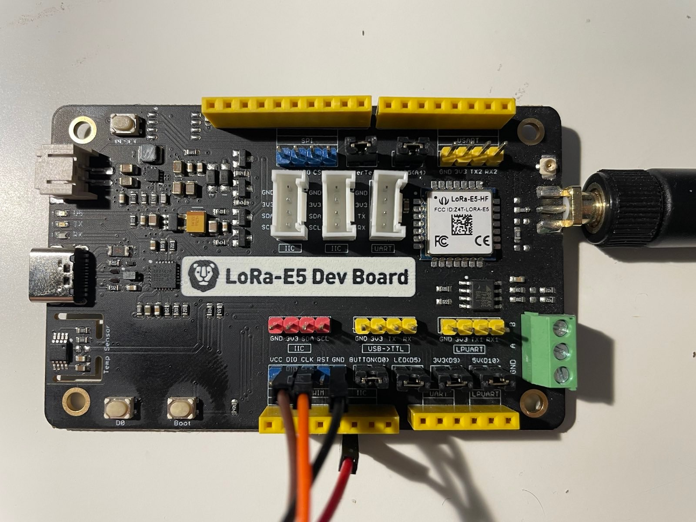
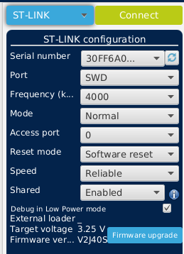
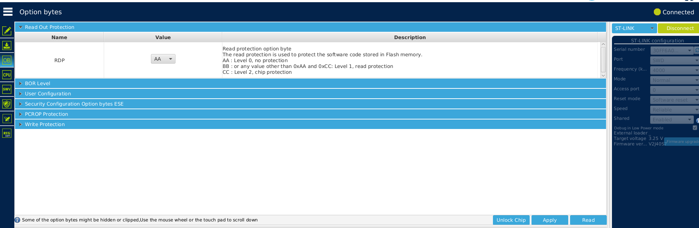

# LoRa e5 dev board unprotect memory

## 1. Introduction

This document describes how to unprotect the memory of the LoRa e5 dev board on the Ubuntu system (Ubuntu 22.04)

### Requirements

1. LoRa e5 dev board
2. STM32CubeProgrammer
3. ST-LINK v2 or ST-LINK v3

## 2. Unprotect memory steps

#
1. Install STM32CubeProgrammer
Instructions can be found on the st website: [link](https://www.st.com/en/development-tools/stm32cubeprog.html)
#
2. Connect the ST-LINK to the LoRa e5 dev board

Here is the connection diagram:

On the LoRa e5 dev board, the pins are as follows:

#
3. Open STM32CubeProgrammer

Configure the connection as follows:

#
4. Click on the "Connect" button 

NOTE: You have to power on the board with the USB-C cable before clicking on the "Connect" button.

The connection should be established. If not, check the connection and try again. You can also try pressing the reset button on the LoRa e5 dev board and restart.

#
5. Go to the "Option Bytes" tab
In the RDP field select value "AA" or (0xAA) and click on the "Apply" button.

#
6. Restart the board

#
7. Check after restart if the RDP is set to AA then go to "Erasing & Programming" tab and click on the "Full chip erase" button.

#
8. The memory is now unprotected and you can flash the board with your own firmware.

## 3. References
[seed-studio-forum](https://forum.seeedstudio.com/t/lora-e5-mini-i-cannot-not-erase-write-or-change-ob-to-the-flash-whereas-i-removed-rdp-from-0xbb-level-1-to-0xaa-level-0/259087/3)

#
_Written by: Adam Krawczyk, wisevision_ 

Do you need support with this topic or have questions about your project? Feel free to contact us! [support@wisevision.com.pl](mailto:support@wisevision.com.pl)